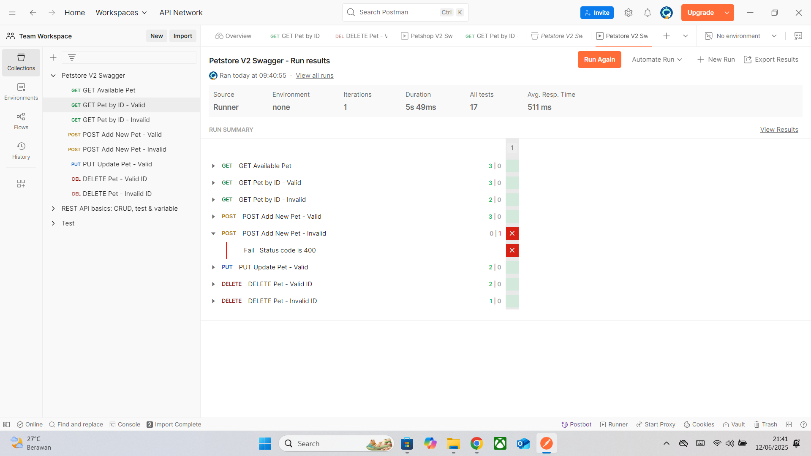

### 🐾 Postman API Testing – Swagger Petstore

This collection contains automated and manual API testing for the public Swagger Petstore API (`/pet`) using Postman.  
The tests are executed using Postman’s Collection Runner.

## 🔧 Tools
- Postman & Collection Runner
- Swagger Petstore API (https://petstore.swagger.io)

## 🧪 Test Scenarios
- `GET /pet/findByStatus` – Retrieve pets by status
- `GET /pet/{petId}` – Retrieve pet by ID (valid & invalid)
- `POST /pet` – Add new pet (valid & invalid)
- `PUT /pet` – Update existing pet
- `DELETE /pet/{petId}` – Delete pet (valid & invalid ID)

##📜Test Cases

## 📸 Test Results

## 📝 Notes
Some endpoints still return `200 OK` even when given invalid input, which indicates weak validation on the API side.

## ⚙️ Setup

1. Clone or download this repository.
2. Open Postman → Import the collection from `./collections/Petshop-V2-Swagger.postman_collection.json`.
3. Run each request manually or use the **Collection Runner** to run all test cases at once.
